# CF-Workers-TGProxy

Cloudflare Workers 的 Telegram Web/MTProto WebSocket 代理中继（KWS Lanes）。

[`telegram_webproxy.js`](./telegram_webproxy.js) 是一个单文件 Cloudflare Workers 实现：它扮演 Telegram 官方 Web Proxy（td web-proxy）后端，把客户端（Desktop / Android）在隔离 webview 里发起的 WebSocket lanes，直接转接到 **Telegram Web K 自己的 KWS 通道**（`kws{dc}[-1].web.telegram.org/apiws`）。

它不再依赖一套独立的 MTProxy / middle proxy 后端：Worker 在本地解开客户端 MTProto 传输层的 obfuscation，再用自己生成的随机密钥重新封一层，拨 Telegram 官方的 Web K 入口。Worker 只处理这层传输混淆（AES-CTR，本身不提供完整性校验），不解密、也不处理内层 MTProto 载荷。内层载荷由客户端与 Telegram 服务器之间的 MTProto 加密保护：普通云聊天并不是聊天双方之间的端到端加密，只有秘密聊天才是。代理运营方和 Cloudflare 仍能看到连接时间、流量大小等元数据。

## 核心能力

当前代码主线包含：

- td web-proxy 页面：nonce + 严格 CSP，仅允许 `frame-ancestors http://127.0.0.1:*`
- Android 应用内 web-proxy 桥（`globalThis.TelegramWebProxy` 双向 postMessage）
- 多 lane WebSocket 复用：子协议 `tproxy-lane-v1.<token>.<sid>`
- MTProto 传输层 obfuscation 重签（mode `0xef` / `0xee` / `0xdd`，DC `1..5`，media 标志）
- 拨号 Telegram 官方 KWS 端点，子协议 `binary`
- HMAC 签名的 bootstrap / session token；session 可续期，并有绝对寿命上限
- 上行 / 下行小包汇聚（`upPack = 20KB`、`dnPack = 32KB`、`dnMs = 1ms`）
- 下行接收缓冲硬上限（每 lane 16 MiB、每实例 48 MiB），超限只关闭该 lane
- 上下游都不协商 WebSocket 压缩
- 可选限速（Workers Rate Limiting 绑定，未配置时退回每实例内存限速）
- 支持最多 4 个 `SECRET` 同时生效，用于平滑轮换

## 代码主路径

```mermaid
flowchart LR
  TG["Telegram Desktop / Android"] -->|webview 加载 web-proxy 页面| P["Worker 页面 (nonce CSP)"]
  P -->|postMessage 端口| L["lanes: 每条流一条 WebSocket"]
  L -->|"tproxy-lane-v1.token.sid"| WS["/api/v1/ws"]
  WS --> S["mkSession → mkStream"]
  S -->|"解 obfuscation (AES-CTR)"| RK["mkHead 重新封层"]
  RK -->|"fetch Upgrade → wss://kwsN[-1].web.telegram.org/apiws"| KWS["Telegram Web K / KWS"]
```



```text
webview 页面
  → 建立 /api/v1/session（POST，带 bootstrap）
  → 拿到 session token + X-Session-Ttl + X-Carrier-Mode: websocket-lanes
  → 按流开 lane：/api/v1/ws + 子协议 tproxy-lane-v1.<token>.<sid>
  → 在 TTL 的约 60% 时 PUT /api/v1/session 续期，换取同一会话的新 token
  → Worker: 解 obfuscation → 重新封头 → 拨 KWS → 中继
```

## 为什么从官方 MTProto 转向 KWS 转换

Telegram 官方的 web-proxy 模型（tproxy）需要一套**独立后端**：客户端连到本地/自建的服务，再经它转发到远端 MTProxy，链路里多一跳、多一套需要自己运维的加解密中转。

本实现把这一整套换掉：

| 维度 | 经 middle/MTProxy 的官方 web-proxy 路径 | 本实现（KWS 转换） |
| --- | --- | --- |
| 后端 | 需自建 MTProxy / middle proxy | 无，Worker 即后端 |
| 传输面加密 | 代理侧承担 mtp 层与 obfuscation | 只落一层 obfuscation（AES-CTR）重签 |
| 出站目标 | 自建中转服务器 | Telegram 官方 `kws*.web.telegram.org` |
| 内层 MTProto 载荷 | 客户端 ↔ Telegram 服务器加密 | 客户端 ↔ Telegram 服务器加密，Worker 不解密 |

也就是说，转向 KWS 的关键点是：**Worker 只处理传输层，不处理 mtp 层**。客户端 MTProto 载荷原样透传，Worker 只对 64 字节 obfuscation 头做一次解、一次重签，再走 Telegram Web K 用的同一入口，边缘可达性与线路质量都直接吃官方域名。

## 性能理论上提升多少倍

> 以下为基于当前代码路径的**理论模型**（标记 `[推断]`），不是本仓库的实测基准。

- **数据面加解密量下降**：相对"经 middle/MTProxy 转发"的路径，本实现每包只做一次 obfuscation（AES-CTR，128-bit 计数器）重签，而不是在代理侧再承担 mtp 层的加解密。数据面 AES 块操作量约降到一半量级 `[推断]`。
- **少一跳 RTT**：去掉自建中转服务器，客户端 → CF 边缘 → Telegram KWS。`[推断]`
- **小包汇聚**：上行 `upPack = 20KB`、下行 `dnPack = 32KB` + `1ms` 观察窗，把高频 tiny frame 压成更少的实际写入。1.8x–39.8x 这组数字来自另一个项目（GrainTCP）同一汇聚核的本地回放（固定 512B 风暴下约 39.8x，mixed 小包约 1.8–2.0x），**不是本仓库的测量结果**。
- **lane 并行**：单会话最多 128 条 lane，每条 lane 是独立的 Worker 调用，不经过单线程的 Durable Object。

综合到瓶颈场景，理论提升从 **约 2x 起**（仅算加解密 + 去跳），小包风暴场景在汇聚部分叠加后可更高。`[推断]` 如需实测，可开启 `LANE_LOG` 后在相同线路和流量下对比。

## 设计重点

### 1. 多 lane 直接替代 Durable Object

公开的 Workers web-proxy 实现大多用 Durable Object 来维持"单条长连接 / 单份状态"。DO 是单线程且需要路由到固定实例，上限和排队都集中在那个对象上。

本实现改为**按流拆 lane**：

- 每条 Telegram 流 = 一条独立 WebSocket，子协议里带 `sid`
- 每条 lane 是一次独立的 Worker 调用。Cloudflare **不保证**同一会话的各条 lane 落在同一个 isolate，session / lease 状态是**各 isolate 自己的** `Map`（见下文"已知限制"）
- 页面侧上行排队：单 lane `laneMax = 8MB` / `laneItems = 1024`，整会话 `qMax = 32MB` / `iMax = 16384`
- Worker 侧下行接收缓冲：单 lane 16 MiB、单实例 48 MiB（按字节加每条 256 字节计）。Workers 的 WebSocket 无法暂停读取，超限时只关闭该 lane 并给客户端发该流的 CLOSE
- lane 数上限 `128`，已用 sid 上限 `4096`

TG 客户端本身就有多流、并且会自动分流，所以 lanes 让**每条流各自背压、各自排队**，而不是把整条会话压进一个单线程对象。

### 2. 小包汇聚

上下行各自把连续小块先收进一颗薄核，再尽量并成更少的实际写入：

```text
上传: collect -> bundle -> peer.write()
下载: collect -> bundle -> dnPack 门控 -> ws.send()
```

- `upPack = 20KB`：上行单次合包目标
- `dnPack = 32KB`：下行聚合上限；`>= 32KB` 直接发，`< 32KB` 进核再等门控
- `dnMs = 1ms`：下行 quiet-window，用来决定何时 flush

目的都是削减高频小 `frame` 带来的固定调度成本，而不是再造一层重型队列。

### 3. 鉴权与会话生命周期

- 页面只下发 nonce + 短期 `bootstrap`（`mkBoot`，2 分钟）。bootstrap 在有效期内**可以重复使用**，不是一次性的
- `POST /api/v1/session` 校验 bootstrap 后签发 `session` token，并通过 `X-Session-Ttl` 告知剩余秒数
- session token 的有效期（默认 5 分钟）**只决定能否新开 lane**。页面在约 60% 时用 `PUT /api/v1/session` 续期，得到同一会话 ID 的新 token；续期允许在过期后 2 分钟内完成
- 会话有**绝对寿命**（默认 24 小时，`SESSION_MAX`）：到点后不能再续期，已建立的 lane 也会在 5 秒内收到 CLOSE 并关闭
- `DELETE /api/v1/session` 在当前 isolate 记下撤销标记：该会话在本 isolate 上的新 lane 返回 `409`、续期被拒，已建立的 lane 在下一条客户端消息时或 5 秒内关闭
- token 为 HMAC-SHA256 截断签名，签名比较走常量时间。原始 `BOOT` 不能直接当作 bearer 使用

单条 lane 建连失败或超出 lane 上限时，页面只给该流回 CLOSE，不影响同一会话的其他流；连续 3 次建连失败，或续期彻底失败后又需要新开 lane，才会让整个会话失败，由客户端重新建立。

### 4. 页面隔离

- 页面 CSP `default-src 'none'`、`sandbox allow-same-origin allow-scripts`、`frame-ancestors http://127.0.0.1:*`
- `/api/v1/ws` 若带 `Origin` 头，必须与自身同源，否则拒绝

### 5. 不协商 WebSocket 压缩

relay 传的是已加密的高熵数据，在 Worker 这层做 WS 压缩换不来收益，反而抬高热路径 CPU（免费版每次调用只有 10 ms CPU）。

- 客户端一侧：握手响应里把 `Sec-WebSocket-Extensions` 置空
- 上游一侧：`new WebSocket(url)` 在 `web_socket_compression`（2023-08-15 起默认开启）下会自动提议 `permessage-deflate`，所以改用 `fetch()` + `Upgrade: websocket` 建立连接、不带扩展头；如果上游响应仍带扩展协商，就放弃这次连接

## 已知限制：会话状态只在单个 isolate 内有效

Cloudflare Workers 不会把同一会话的请求固定到同一个 isolate。当前实现没有使用 Durable Objects，因此：

- **撤销不能跨实例保证**。`DELETE` 只在处理它的 isolate 上生效。其他 isolate 上，持有该会话 token 的一方仍可开新 lane、续期，最坏情况持续到会话绝对寿命（`SESSION_MAX`，默认 24 小时）结束。
- **配额是每实例的**。"每会话 128 条 lane / 4096 个 sid"只在单个 isolate 内计数，不是全局配额。
- 正常使用不受影响：页面关闭时会先关掉自己的所有 lane 再发 `DELETE`，撤销主要是为了对付 token 泄露。session token 只存在于页面内存和 WebSocket 子协议头中，请勿记录握手头。

如需更强保证：

- 缩短 `SESSION_MAX`，可以缩小撤销失效的最坏窗口。
- **紧急停用全部会话**：更换 `BOOT`。所有 session token 立即失效，不能新开 lane、也不能续期；已建立的 lane 最迟在各自的 `SESSION_MAX` 到点时关闭。更换变量会触发重新部署，旧 isolate 被回收时其上的连接也会断开，但断开时机由 Cloudflare 决定。
- 真正的跨实例撤销需要引入 Durable Objects 做中心化协调，本仓库暂不包含。

另外，持有代理链接（`SECRET`）的人都能自己算出 bridge URL 并领取 bootstrap/session，所以每会话的 lane 上限并不能防止滥用；控制资源消耗要靠下文的限速。

## 凭据与轮换

- **bridge URL 不能设有效期**。`?bridge=` 的值是 Telegram 客户端按官方协议在本地计算的：`base64url(HMAC-SHA256(SECRET, "tdesktop-web-proxy-bridge-v1\n" + 主机名))`。任何拿到代理链接的人都能算出它，所以它和 `SECRET` 本身一样敏感。
- **轮换 `SECRET`**：
  1. 把新密钥放在前面，例如 `SECRET="新密钥,旧密钥"`。新旧客户端此时都能连接，Worker 会逐个尝试密钥。
  2. 分发新的代理链接。
  3. 确认客户端都已迁移后，从 `SECRET` 中删掉旧密钥。
  - 最多同时配置 4 个密钥，用逗号或空白分隔。
- **轮换 `BOOT`**：会立即使所有 bootstrap/session token 失效，页面会重新建立会话。

## 限速与资源

- **未配置绑定时**：按 `CF-Connecting-IP`，在每个 isolate 内用 60 秒固定窗口计数：
  - 页面下发 + 会话创建/续期：合计 30 次；
  - lane 握手：300 次；
  - 超限返回 `429`。
- **可选绑定**：配置 Workers Rate Limiting 绑定 `RL_SESSION` / `RL_LANE` 后改用它们（见 [`wrangler.example.toml`](./wrangler.example.toml)）。注意它们按 Cloudflare 节点各自计数。
- **想节省免费请求额度时**：Worker 内的限速只能保护 CPU 和内存，被拒绝的请求仍计入额度。可以在 Cloudflare 控制台为该主机名配置 WAF 速率限制规则，让异常流量在到达 Worker 之前就被拦下。
- **请求数估算**（免费版每日 100,000 次）：
  - 每个会话：页面 1 次 + 创建 1 次 + 每条 lane 1 次 + DELETE 1 次；
  - 页面打开期间每约 3 分钟续期 1 次，即每台设备每小时约 20 次。

## 当前配置

| 变量 | 意义 | 默认值 |
| --- | --- | --- |
| `dnPack` | 下行聚合上限 | `32 * 1024` |
| `upPack` | 上行合包目标 | `20 * 1024` |
| `dnMs` | 下行 quiet-window | `1`（ms） |
| `win` | 每流初始信用额度（客户端授权超过 2 倍视为协议错误） | `4 MiB` |
| `dnLaneMax` / `dnAllMax` | Worker 下行接收缓冲：单 lane / 单实例 | `16 MiB` / `48 MiB` |
| lane 上限 | 单会话并发 lane 数（每实例） | `128` |
| `laneMax` / `laneItems` | 页面上行：单 lane 字节 / 条数上限 | `8MB` / `1024` |
| `qMax` / `iMax` | 页面上行：整会话字节 / 条数上限 | `32MB` / `16384` |
| bootstrap TTL | bootstrap token（有效期内可重复使用） | `2` 分钟 |
| session TTL | 新开 lane 的准入窗口，自动续期 | `5` 分钟（`SESSION_TTL`） |
| session 绝对寿命 | 到点关闭所有 lane | `24` 小时（`SESSION_MAX`） |
| 续期宽限 | 过期后仍可续期 / 注销的时间 | `2` 分钟 |
| 撤销检查间隔 | 已建立 lane 检查撤销与寿命 | `5` 秒 |
| 回退限速 | 每 IP 每 60 秒：会话类 / lane 握手 | `30` / `300` |
| KWS 端点 | Telegram Web K 出站 | `kws{1..5}[-1].web.telegram.org/apiws` |

## 密钥与环境变量

| 绑定 | 意义 | 要求 |
| --- | --- | --- |
| `SECRET` | 代理密钥：AES-CTR 传输密钥派生 + `?bridge=` 能力签名 | 每个为 `32` 位 hex，或 `dd` / `ee` / `ef` 前缀 + 32 位 hex（共 `34`）；大小写不敏感，建议小写；最多 4 个，逗号或空白分隔，用于轮换 |
| `BOOT` | 签发 bootstrap / session token 的 HMAC 密钥（不会下发到页面） | 仅要求非空，建议 ≥ `16` 字符随机串 |
| `SESSION_TTL` | 可选，session token 有效期（秒） | `10`–`3600`，默认 `300` |
| `SESSION_MAX` | 可选，会话绝对寿命（秒） | `60`–`604800`，默认 `86400` |
| `LANE_LOG` | 可选，设为 `1` 时每条 lane 关闭时输出一行 JSON 统计 | 只含原因、时长、上下行字节、DC，不含 token、IP 或请求头 |
| `RL_SESSION` / `RL_LANE` | 可选，Workers Rate Limiting 绑定 | 见 `wrangler.example.toml` |

生成命令：

| 目标 | 命令 | 输出 |
| --- | --- | --- |
| `SECRET` | `openssl rand -hex 16` | `32` 位 hex |
| `SECRET`（带前缀） | `printf 'dd%s\n' "$(openssl rand -hex 16)"` | `34` 位 hex |
| `BOOT` | `openssl rand -hex 24` | `48` 位 hex |

`openssl rand` 使用系统 CSPRNG。`SECRET` / `BOOT` 缺失、格式不对或 `SECRET` 超过 4 个时，`mkCfg` 直接抛错，`/health` 会返回 `500` 而不是 `{"ok":true}`。

## 路由

| 路径 | 方法 | 说明 |
| --- | --- | --- |
| `/` | `GET` / `HEAD` | 校验 bridge 签名后下发 web-proxy 页面 |
| `/health` | `GET` | `{"ok":true}` |
| `/api/v1/session` | `POST` | 建会话，返回 session token 与 `X-Session-Ttl` |
| `/api/v1/session` | `PUT` | 续期，返回同一会话的新 token（`204`） |
| `/api/v1/session` | `DELETE` | 注销会话（当前 isolate） |
| `/api/v1/ws` | `GET` | lane WebSocket（需 `Upgrade` 与正确子协议） |

## 部署

- **Dashboard**：直接粘贴 `telegram_webproxy.js`，在设置中添加 `SECRET`、`BOOT`（建议用加密变量）以及需要的可选变量。
- **wrangler**：参考 [`wrangler.example.toml`](./wrangler.example.toml)，机密用 `wrangler secret put` 设置。
- **升级提示**：本版本的 session token 格式变了。升级后，旧页面签发的会话在需要新开 lane 时会失败一次，由客户端自动重新建立。

## 测试

```sh
npm install      # 只安装测试用的 miniflare，Worker 本身没有依赖
npm test
```

- `tests/unit.test.mjs`：纯函数测试，只需 Node ≥ 20。覆盖：
  - 官方 bridge 测试向量
  - token 签发与续期
  - AES-CTR 分块，以及重叠调用时报错而不复用密钥流
  - 帧与拆包
  - 握手头过滤
  - 缓冲上限
  - 限速
- `tests/integration.test.mjs`：在 Miniflare 中运行 Worker，并用模拟 KWS 验证以下行为：
  - 中继往返，上游不协商压缩
  - 下游停止授权时只关闭该 lane
  - 续期与绝对寿命
  - DELETE 撤销
  - 大量撤销后仍能建新会话
  - 限速
  - 多密钥轮换
  - 数据中心不可达
- `tests/page.test.mjs`：在 Node 中驱动 bridge 页面脚本（模拟 Telegram 客户端），验证以下行为：
  - 自动续期
  - 单流失败隔离
  - 超限 OPEN
  - 关闭时注销
- 设置 `TGPROXY_WORKER=/path/to/old.js` 可以用同一套测试检查其他版本。

模拟 KWS 不能代替真机测试。部署后仍需用 Desktop / Android 实测：

- 连接超过 5 分钟后打开其他 DC 的媒体；
- 下载中途让客户端挂起；
- 在 Observability 中查看 CPU 时间与 `1102` 错误。

## 文件

| 文件 | 说明 |
| --- | --- |
| [telegram_webproxy.js](./telegram_webproxy.js) | Worker 主实现：页面 / session / lane / obfuscation / KWS 中继 |
| [wrangler.example.toml](./wrangler.example.toml) | wrangler 部署示例（可选绑定以注释给出） |
| [tests/](./tests) | 单元、集成与页面测试 |

## 访问优化（CNAME / SaaS 优选）

- 使用**自有域名 + CNAME**，或直接走 Cloudflare **SaaS（自定义主机名）优选**，以获得更好的接入体验。
- 参考实现中曾出现第三方线路（非官方 `web.telegram.org` 域名）导致边缘层 `1034` / `403`；换成官方 web 域名后恢复正常，因此**优先使用 Telegram 官方 web 域名与稳定的自有 CNAME / Custom Domain**，避免依赖质量不稳定的中间线路。

## 相关链接

- 开源协议：[GPL-3.0](./LICENSE)
- 频道 / 交流群组：<https://t.me/Enkelte_notif>
- Telegram Desktop（tdesktop）：<https://github.com/telegramdesktop/tdesktop>
- Telegram Android（DrKLO）：<https://github.com/DrKLO/Telegram>
- Telegram tproxy-server：<https://github.com/telegramdesktop/tproxy-server>

## Stargazers over time

[](https://starchart.cc/ToiCF/CF-Workers-TGProxy)
